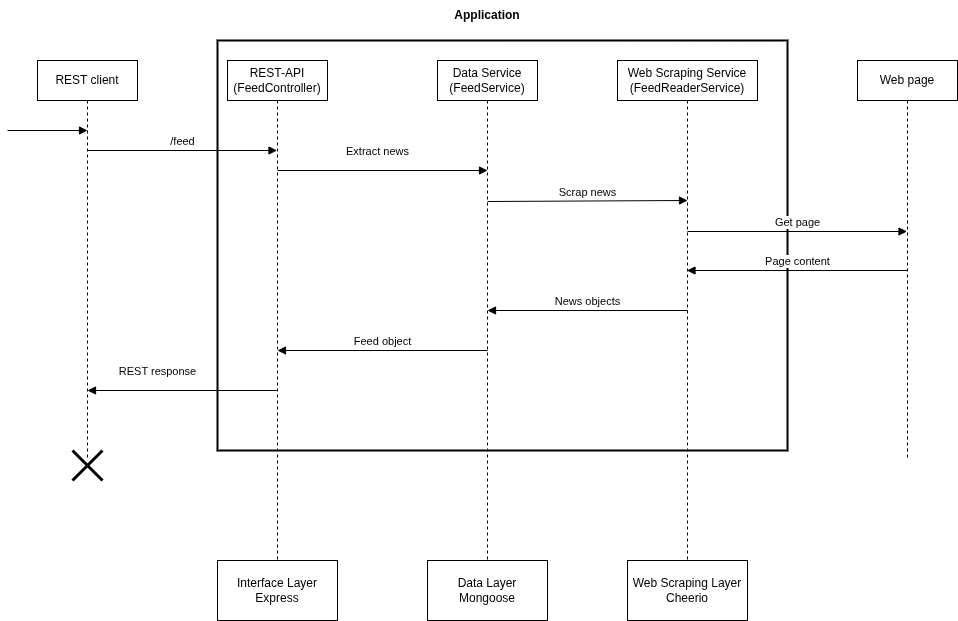

# Daily Trends Demo

A simple REST API demo, to setup and get news feed.

# Application desing

This diagram explain the architecture and general interaction flow of the application.



# Development environment

First set a .env.local environment file in the direcory root, with the following environment variables:

```bash
NODE_ENV=local
PORT=3000

MONGODB_SERVER_URI=mongodb://yourmongodbserver:27017
MONGODB_DB_NAME=db_name
MONGODB_USER=mongodb_user
MONGODB_PASSWORD=mongodb_password

# Maximum number of news that will be scraped per feed.
FEED_MAX_NEWS_COUNT=5
```

Open a terminal in the project root directory, and execute the following npm script to start the development server.

```bash
npm run dev
```

In this point you can test the application locally and edit files with watch capabilities.

The Swagger documentation of the REST API is at /api-docs.
